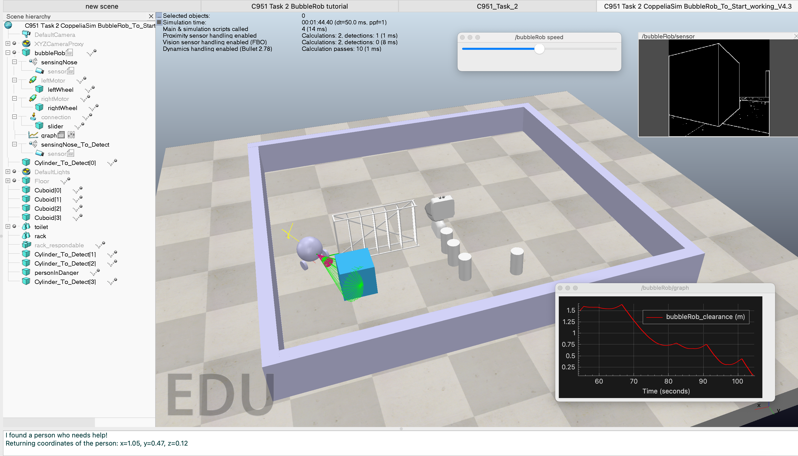

# Disaster Recovery Robot

## Overview
Developed in the CoppeliaSim environment and programmed using LUA, this simple Disaster Recovery Robot is designed to assist recovery teams during disasters. Its primary mission is to navigate challenging environments—filled with various obstacles—to locate survivors and report their coordinates back to the team. The robot is equipped with two advanced sensors: one for detecting obstacles to facilitate navigation and another for identifying human targets. This allows the robot to effectively contribute to rescue operations by pinpointing survivors' locations in real-time.

## Features
- **Targeted Human Detection**: Uses advanced sensors to recognize and focus on 'human_object' tags, identifying survivors in disaster environments.
- **Coordinate Calculation and Reporting**: Calculates and communicates exact coordinates of survivors using vector multiplication, delivering data essential for rescue operations.
- **Selective Search Protocol**: Focuses search efforts on objects tagged as 'human_object', enhancing efficiency and effectiveness simulating efficient search efforts in disaster conditions by focusing on designated human-like targets.

## What I learned
- **Programming in LUA**: Enhanced my coding skills in LUA, focusing on specific functionalities within the CoppeliaSim environment.
- **Sensor Integration**: Gained hands-on experience in integrating and configuring sensors to detect and differentiate tagged objects effectively.
- **Simulation and Testing**: Learned to set up and test robotic behaviors in simulated environments, improving my troubleshooting and problem-solving abilities in robotics.

## Ways to Improve
- **Internal Mapping System**: Implement a mapping system to allow the robot to track areas it has explored, ensuring at least 95% coverage of each room before exiting, reducing the chance of missing any humans or resources.
- **Dynamic Movement Adjustments**: Program the robot to alter its movement strategies when repetitive patterns are detected, such as switching directions upon encountering obstacles, to avoid inefficiencies and ensure thorough exploration.
- **Advanced Pathfinding Algorithms**: Integrate sophisticated pathfinding algorithms like A* to enhance the robot's navigation in complex environments, optimizing its route to cover more ground effectively.
- **Reinforcement Learning Integration**: Employ reinforcement learning techniques to enable the robot to learn and adapt its actions based on previous experiences, increasing the explored area and improving overall search effectiveness.

## Disaster Recovery Robot in Action

